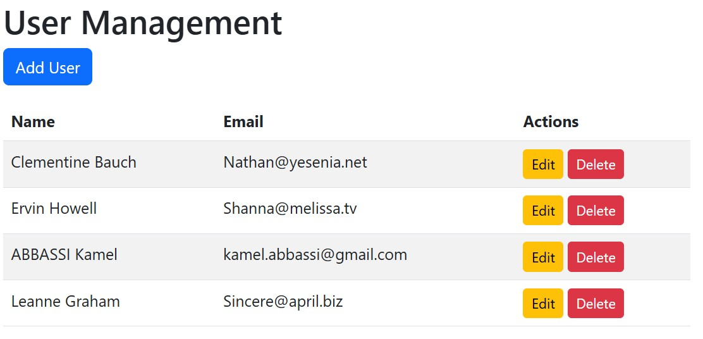
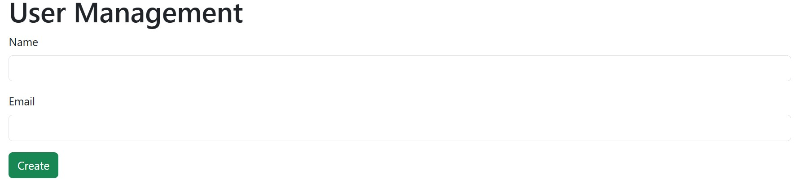
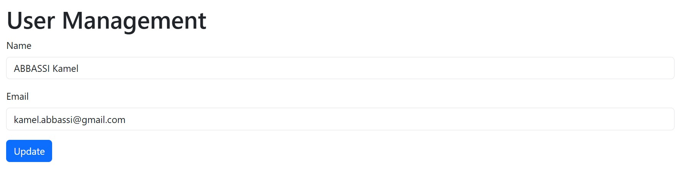
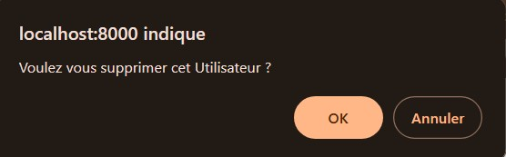

# Projet MVC - Gestion des Utilisateurs

Ce projet est un atelier pratique visant à mettre en place une structure MVC complète tout en apprenant les concepts fondamentaux des opérations CRUD (Créer, Lire, Mettre à jour, Supprimer). 

## Objectifs de l'atelier

- Comprendre la structure MVC.
- Implémenter un projet simple en respectant le modèle MVC.
- Gérer les utilisateurs avec les opérations CRUD.

## Fonctionnalités

1. **Créer** : Ajout d'un nouvel utilisateur dans la base de données.
2. **Lire** : Affichage de la liste des utilisateurs.
3. **Mettre à jour** : Modification des informations d'un utilisateur existant.
4. **Supprimer** : Suppression d'un utilisateur de la base de données.

## Structure du Projet

Le projet suit l'architecture MVC classique :

```
├── controllers
│   ├── UserController.php
├── models
│   ├── User.php
├── views
│   ├── user
│       ├── create.php
│       ├── edit.php
│       ├── index.php
│       ├── delete.php
├── config
│   ├── database.php
├── public
│   ├── index.php
```

### Explications :
- **controllers/** : Contient les fichiers responsables de la logique métier.
- **models/** : Contient les fichiers liés à la gestion des données (ex. : récupération et manipulation des données utilisateur).
- **views/** : Contient les fichiers d'affichage pour l'interface utilisateur.
- **config/** : Contient la configuration de la base de données.
- **public/** : Contient le fichier d'entrée principal (`index.php`).

## Pré-requis

- PHP >= 7.4
- MySQL
- Serveur web (Apache ou Nginx)
- Composer (si applicable)

## Installation

1. Clonez le dépôt :

   ```bash
   git clone https://github.com/kbma/mvc_user_management.git
   ```

2. Configurez votre base de données dans `config/database.php`.

3. Importez le fichier SQL situé dans `database/schema.sql` pour créer la structure de la base de données.

4. Démarrez le serveur local :

   ```bash
   php -S localhost:8000 -t public
   ```

5. Accédez à l'application via [http://localhost:8000](http://localhost:8000).

## Captures d'écran

### Liste des utilisateurs



### Formulaire d'ajout d'utilisateur



### Modification d'un utilisateur



### Confirmation de suppression



## Contributions

Les contributions sont les bienvenues ! N'hésitez pas à proposer des améliorations ou signaler des bugs via des issues ou des pull requests.

## Auteurs

- **Kamel Abbassi**

## Licence

Ce projet est sous licence MIT. Voir le fichier `LICENSE` pour plus de détails.
